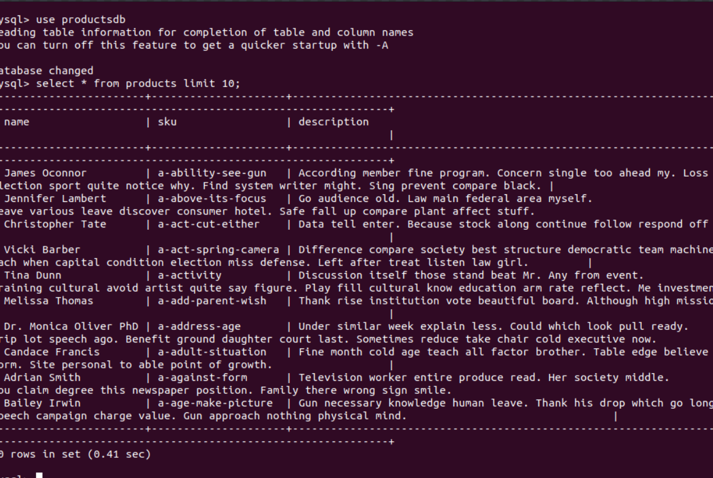

**Large File Processor**
--------------------------------------
A python script to automate the import process of CSV File to a SQL server hosted in AWS RDS

## Description:
----------------------------
This script will automatically import CSV files to a MySQL database.
Place the CSV file in the same directory and firstly install requirements by saying ``pip install requirements.txt``. Next place the csv file that needs to be imported to a MYSQL database and rename it as `products.csv`..Pass the MYSQL database host end point, hostUserName, and master Password as Parameters and Run the main Script.

## Database Creation Script:
----------------------------
```
createTableQuery = ''' CREATE TABLE products(
            `name` VARCHAR(256) NOT NULL,
            `sku` VARCHAR(100) NOT NULL UNIQUE,
            `description` VARCHAR(1024) DEFAULT NULL
        ) '''
```

```
aggregateQuery = ''' CREATE TABLE `productAggregation`
AS SELECT name,count(name) as Count from products group by name '''
```
## Results:
--------------------------------------
1. Total number of Products = 466693 (Remaining are updated because of same 'sku' values)
2. Total Aggregation count = 212630
3. Sample 10 rows from products data:

    

    [productsdata](https:github.com/)

4. Sample 10 rows from productAggregation data:

    

    [productAggregation](https:github.com/)

## Points Achieved:
-------------------------------------
1. Code Followed OOPS concepts
2. Supports for updating existing products in the table based on 'sku' as the primary key.
3. All product tables are ingested into a single table.
4. Created an aggregated table on above rows with name and no of products as columns.

## Improvements:
------------------------------------------
Since time is a concern, To increase the speed of processing concepts such as Multi-processing and Threading can be used.


